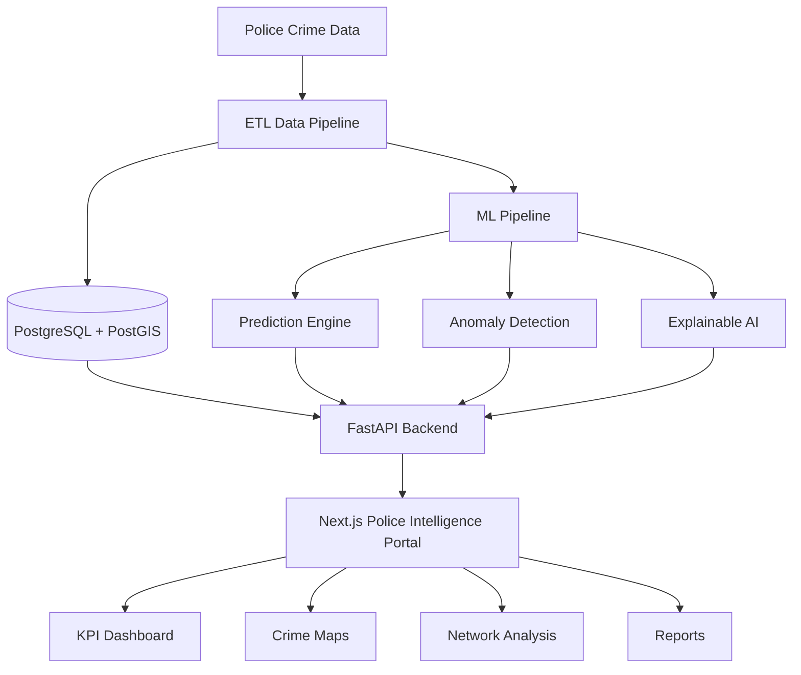
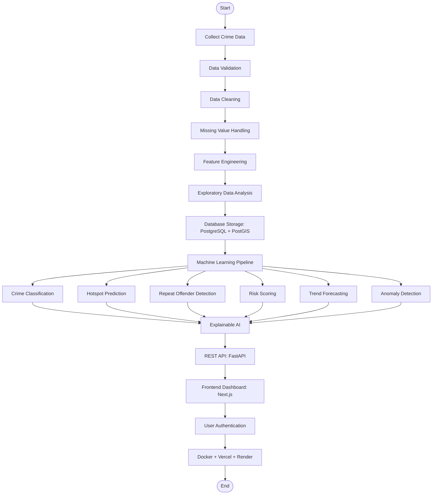
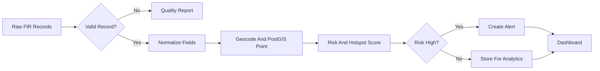
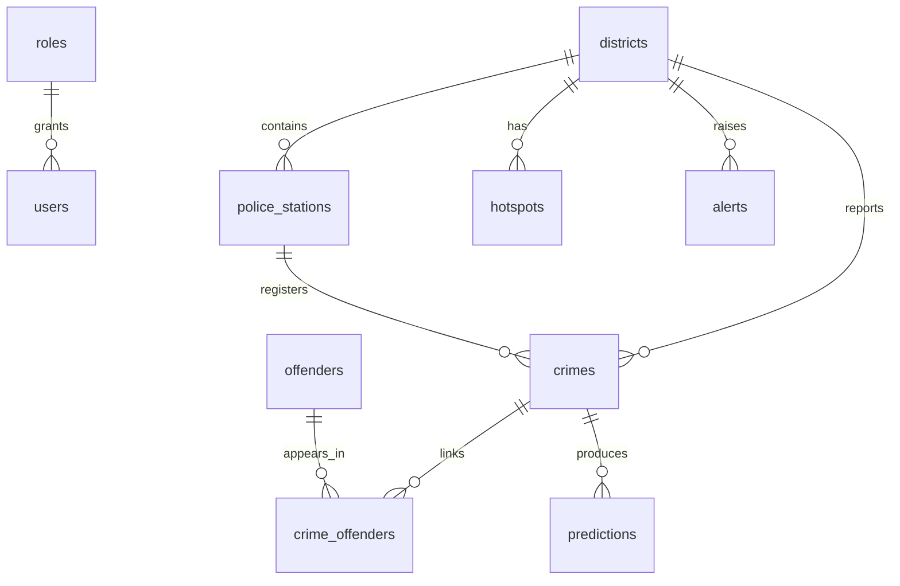
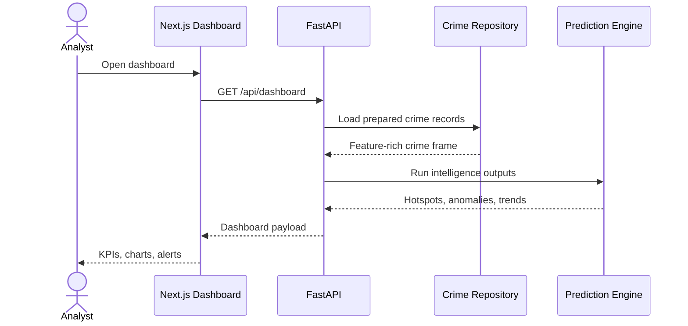
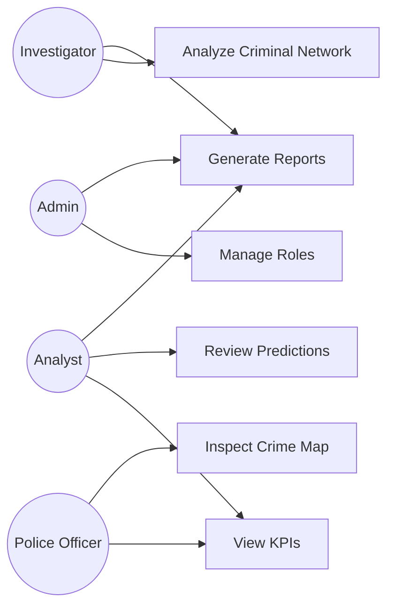
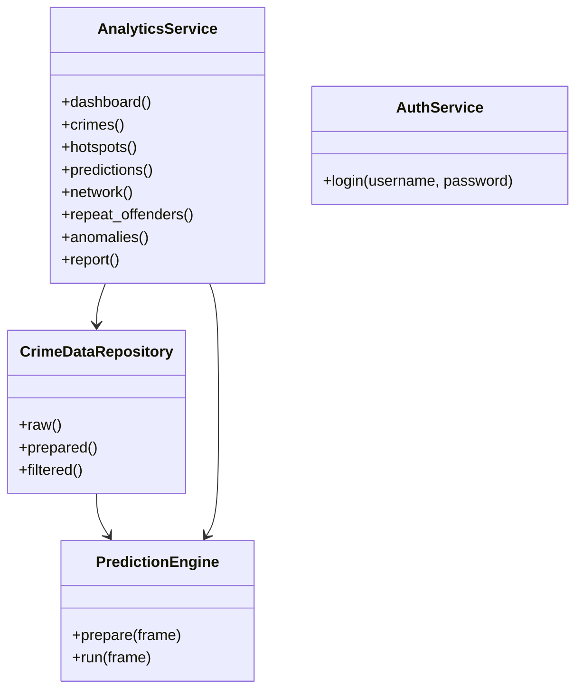

# Diagrams

## Architecture Diagram

```mermaid
flowchart TD
    A[Police Crime Data] --> B[ETL Data Pipeline]
    B --> C[(PostgreSQL + PostGIS)]
    B --> D[ML Pipeline]
    D --> E[Prediction Engine]
    D --> F[Anomaly Detection]
    D --> G[Explainable AI]
    C --> H[FastAPI Backend]
    E --> H
    F --> H
    G --> H
    H --> I[Next.js Police Intelligence Portal]
    I --> J[KPI Dashboard]
    I --> K[Crime Maps]
    I --> L[Network Analysis]
    I --> M[Reports]
```

## Workflow Diagram

```mermaid
flowchart TD
    Start([Start]) --> Collect[Collect Crime Data]
    Collect --> Validate[Data Validation]
    Validate --> Clean[Data Cleaning]
    Clean --> Missing[Missing Value Handling]
    Missing --> Features[Feature Engineering]
    Features --> EDA[Exploratory Data Analysis]
    EDA --> Store[Database Storage: PostgreSQL + PostGIS]
    Store --> ML[Machine Learning Pipeline]
    ML --> Classify[Crime Classification]
    ML --> Hotspot[Hotspot Prediction]
    ML --> Repeat[Repeat Offender Detection]
    ML --> Risk[Risk Scoring]
    ML --> Trend[Trend Forecasting]
    ML --> Anomaly[Anomaly Detection]
    Classify --> Explain[Explainable AI]
    Hotspot --> Explain
    Repeat --> Explain
    Risk --> Explain
    Trend --> Explain
    Anomaly --> Explain
    Explain --> API[REST API: FastAPI]
    API --> UI[Frontend Dashboard: Next.js]
    UI --> Auth[User Authentication]
    Auth --> Deploy[Docker + Vercel + Render]
    Deploy --> End([End])
```

## Flowchart

```mermaid
flowchart LR
    Raw[Raw FIR Records] --> Quality{Valid Record?}
    Quality -->|No| Reject[Quality Report]
    Quality -->|Yes| Normalize[Normalize Fields]
    Normalize --> Geo[Geocode And PostGIS Point]
    Geo --> Score[Risk And Hotspot Score]
    Score --> Alert{Risk High?}
    Alert -->|Yes| Notify[Create Alert]
    Alert -->|No| Archive[Store For Analytics]
    Notify --> Dashboard[Dashboard]
    Archive --> Dashboard
```

## Database ER Diagram

```mermaid
erDiagram
    roles ||--o{ users : grants
    districts ||--o{ police_stations : contains
    districts ||--o{ crimes : reports
    police_stations ||--o{ crimes : registers
    crimes ||--o{ crime_offenders : links
    offenders ||--o{ crime_offenders : appears_in
    crimes ||--o{ predictions : produces
    districts ||--o{ hotspots : has
    districts ||--o{ alerts : raises
```

## Sequence Diagram

```mermaid
sequenceDiagram
    actor Analyst
    participant UI as Next.js Dashboard
    participant API as FastAPI
    participant Repo as Crime Repository
    participant ML as Prediction Engine
    Analyst->>UI: Open dashboard
    UI->>API: GET /api/dashboard
    API->>Repo: Load prepared crime records
    Repo-->>API: Feature-rich crime frame
    API->>ML: Run intelligence outputs
    ML-->>API: Hotspots, anomalies, trends
    API-->>UI: Dashboard payload
    UI-->>Analyst: KPIs, charts, alerts
```

## Use Case Diagram

```mermaid
flowchart LR
    Admin((Admin))
    Officer((Police Officer))
    Investigator((Investigator))
    Analyst((Analyst))
    Dashboard[View KPIs]
    Map[Inspect Crime Map]
    Network[Analyze Criminal Network]
    Reports[Generate Reports]
    Settings[Manage Roles]
    Predictions[Review Predictions]
    Admin --> Settings
    Admin --> Reports
    Officer --> Dashboard
    Officer --> Map
    Investigator --> Network
    Investigator --> Reports
    Analyst --> Dashboard
    Analyst --> Predictions
    Analyst --> Reports
```

## Class Diagram

```mermaid
classDiagram
    class CrimeDataRepository {
      +raw()
      +prepared()
      +filtered()
    }
    class PredictionEngine {
      +prepare(frame)
      +run(frame)
    }
    class AnalyticsService {
      +dashboard()
      +crimes()
      +hotspots()
      +predictions()
      +network()
      +repeat_offenders()
      +anomalies()
      +report()
    }
    class AuthService {
      +login(username, password)
    }
    CrimeDataRepository --> PredictionEngine
    AnalyticsService --> CrimeDataRepository
    AnalyticsService --> PredictionEngine
```
